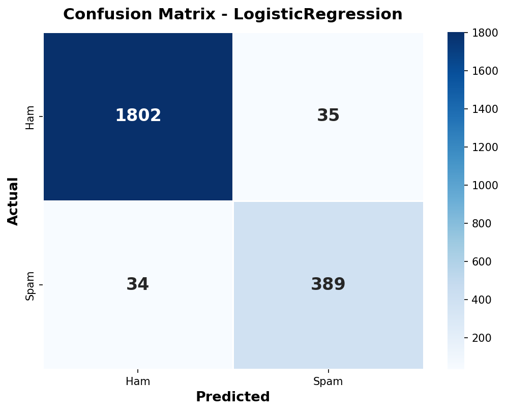
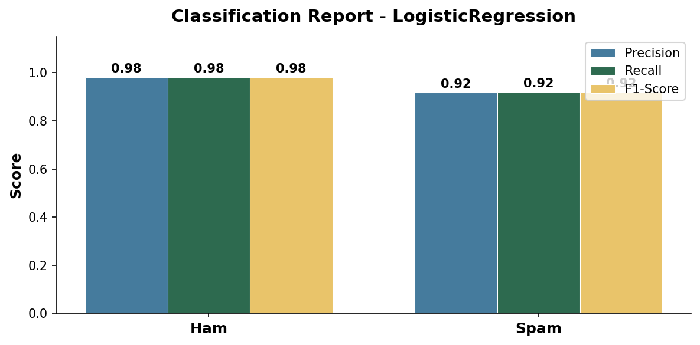
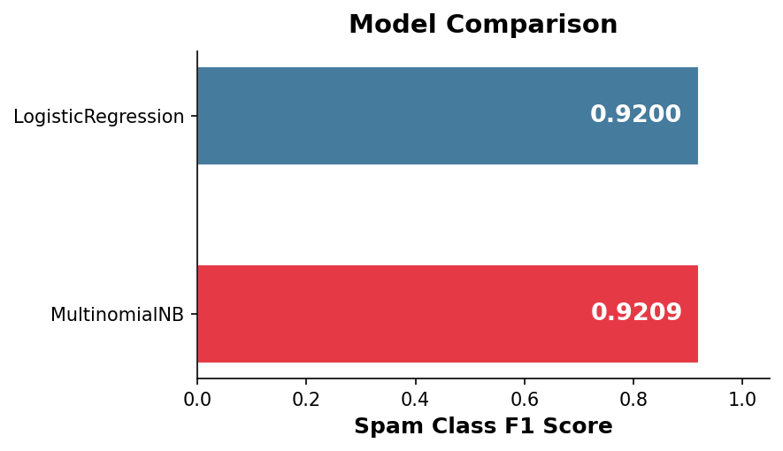

<div align="center">

# `SPAM FILTER`

**Instant spam detection powered by machine learning**


*Paste a message. Know in milliseconds if it's spam.*

[](https://spam-detection-0rq5.onrender.com/)

</div>

---

## 🔍 About

> [!IMPORTANT]
> **Model Training Notebook**: The full pipeline - data loading, preprocessing, model training, and evaluation - is available in [`train_model.ipynb`](notebook/train_model.ipynb).

This is a full-stack spam classifier that takes any SMS or email text and instantly tells you whether it is spam or a legitimate message, powered by a Logistic Regression model trained on a hybrid dataset of 11,300 messages (5,572 SMS + 5,728 Emails).

The interface is built using a modern-minimalist **Bento Grid Instrument Panel** with a curated **Cobalt** theme. Paste a message, run a diagnosis, and watch the 12-bar animated frequency spectrogram react—spiking erratically for spam anomalies, or resting in a calm green ripple for legitimate messages. The **Signal Inspector** displays the exact tokens that drove the model's classification, showing their log-odds weights so you can audit the decision in real-time.

The backend is a FastAPI app that loads the TF-IDF + Logistic Regression pipeline once at startup and serves predictions directly from memory. The frontend is built with vanilla HTML, CSS, and JavaScript.

> [!NOTE]
> The model achieves a **Spam F1-score of 92.65%** with **92% precision and 94% recall** on a hybrid SMS + Email dataset using balanced class weights and a vocabulary restricted to 10,000 features.

---

## 🌐 Live Demo

<div align="center">

[](https://spam-detection-0rq5.onrender.com/)

*Try it yourself - paste a message and see the analyzer in action.*

</div>

---

## ✨ Features

### Core Classification Engine

- **Instant Verdict** - Paste any text, get a Spam or Clean result in milliseconds. The model runs TF-IDF vectorization and Logistic Regression inference entirely in memory on every request.

- **Signal Inspector** - Surfacing the top 5 words that most influenced the classification as tagged chips with their log-odds scores (e.g. `now +3.2`, `at -1.8`). These represent the actual internal weights of the model.

- **Confidence Score** - Every prediction includes a probability confidence value. A result of `98.0%` means the model is highly certain; a result closer to `55%` means the message is borderline.

### UI and Experience

- **Bento Grid Dashboard** - Clean layout macrostructure grouping visual components into discrete, beautiful cards (Signal Input, Signal Spectrum, Verdict Output, Signal Inspector, and Reference Payloads).

- **⌘K Command Palette** - Fully interactive keyboard-navigable command palette dialog (`⌘K` or `Ctrl+K`) to trigger common actions or load payloads.

- **Pulsing Status Indicators** - Real-time state indicators (READY, ANALYZING, SPAM, CLEAN) styled with smooth transitions and animations.

- **Reference Payloads** - Six interactive example buttons (three spam, three ham) to test the classifier instantly.

- **Keyboard Shortcuts**:
  - `⌘K` / `Ctrl+K` opens the command palette.
  - `⌥C` clears and resets the input field.
  - `⌘1` through `⌘6` instantly loads the corresponding reference example.

- **Responsive & Accessible** - Responsive columns wrapping cleanly to a single-column layout on mobile. ARIA role declarations for assistive tech, focus-visible styling on inputs, and fallback reduced-motion support.

---

## 🛠️ Built With

| Technology | Role in this project |
|---|---|
|  | Core runtime for data processing, model training, and the API server |
|  | TF-IDF vectorizer and Logistic Regression classifier packaged as a single `Pipeline` |
|  | Prediction and health API with automatic Pydantic validation and Swagger docs |
|  | ASGI server that runs FastAPI with async I/O support |
|  | Loads and cleans the 11,300-row hybrid SMS + Email dataset from CSV |
|  | Numerical operations during prediction and probability extraction |
|  | Semantic page structure with accessible ARIA labels and live regions |
|  | Custom design system, CSS variables, spectrogram keyframe animations |
|  | API calls, state management, signal chip rendering, and spectrogram control |

---

## 📊 Model Evaluation

These plots are generated during training and saved to `model/results/`.

<div align="center">

### Confusion Matrix


*The model maintains a strong balance between catching spam and protecting legitimate messages.*

<br/>

### Classification Report


*92% spam precision with 94% recall - a balanced tradeoff that catches most spam while keeping false positives low.*

<br/>

### Model Comparison


*Comparison of classifiers evaluated on the same train/test split of the hybrid dataset.*

</div>

---

## ⚙️ Technical Details

### Project Structure

```
Spam Detection/
├── app/
│   └── main.py                 # FastAPI app - routes, validation, word-level signals
├── notebook/
│   └── train_model.ipynb       # Full training, evaluation, and plot generation
├── data/
│   ├── spam.csv                # 5,572-row UCI SMS Spam Collection dataset
│   └── emails.csv              # 5,728-row Enron/SpamAssassin email dataset
├── model/
│   ├── model.pkl               # Serialized TF-IDF + Logistic Regression pipeline
│   └── results/                # Confusion matrix and classification report plots
│       ├── confusion_matrix.png
│       └── classification_report.png
├── static/
│   ├── index.html              # App markup and structure
│   ├── style.css               # Design system, animations, signal chip styles
│   └── script.js               # API calls, state machine, signal inspector renderer
├── requirements.txt            # Pinned dependencies
└── README.md
```

### Model Details

| | |
|---|---|
| **Dataset** | Hybrid SMS & Email (5,572 SMS + 5,728 Emails, 11,300 total) |
| **Classes** | `spam` (2,115 messages, 18.7%) / `ham` (9,185 messages, 81.3%) |
| **Preprocessing** | Lowercase, URL removal, punctuation strip, whitespace normalization |
| **Vectorizer** | `TfidfVectorizer` with `ngram_range=(1,2)` and `max_features=10000` |
| **Classifier** | `LogisticRegression` - class_weight='balanced', C=1.0 |
| **Pipeline** | Scikit-learn `Pipeline(['tfidf', 'clf'])` |
| **Train / test split** | 80% / 20%, `random_state=42` |
| **Spam Precision** | 92% |
| **Spam Recall** | 94% |
| **Spam F1** | 92.65% |

---

### 💻 Local Setup

```bash
# 1. Clone the repo
git clone https://github.com/yash5123/Spam-Detection.git
cd "Spam-Detection"

# 2. Install dependencies
pip install -r requirements.txt

# 3. Start the server
uvicorn app.main:app --host 127.0.0.1 --port 8000
```

Open `http://127.0.0.1:8000/` - the frontend is served automatically.

---

### 🚀 Deployment

Deployed on **Render** as a single web service. FastAPI serves both the API routes and the static frontend from one process.

| Setting | Value |
|---|---|
| **Build command** | `pip install -r requirements.txt` |
| **Start command** | `uvicorn app.main:app --host 0.0.0.0 --port $PORT` |
| **Runtime** | Python 3.13+ |
| **Plan** | Free tier (cold starts ~30s after inactivity) |

---

### Package Versions

| Package | Version |
|---|---|
| fastapi | 0.136.1 |
| uvicorn | 0.46.0 |
| scikit-learn | 1.8.0 |
| pandas | 2.3.3 |
| numpy | 2.4.2 |
| joblib | 1.5.3 |

> [!TIP]
> The scikit-learn version **must match** between your training environment and your serving environment. Pin the version in `requirements.txt` and do not upgrade it without retraining.

---

<div align="center">

### Made by Yash

[](https://github.com/yash5123)

</div>
